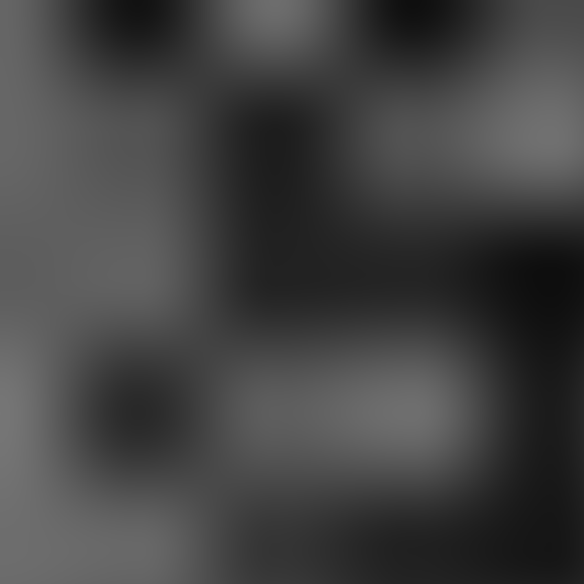

# Cherry Graphical Library


## Quick Start
```console
$ ./build.sh
$ ./example
```

## References:
> - **PPM File Format:** https://en.wikipedia.org/wiki/Netpbm
> - **Bresenham line algorithm:** https://en.wikipedia.org/wiki/Bresenham%27s_line_algorithm
> - **Ellipse Stroke:** https://mathopenref.com/coordparamellipse.html
> - **BMP File Format:** https://en.wikipedia.org/wiki/BMP_file_format
> - **Perlin Noise:**
>   - https://mrl.cs.nyu.edu/~perlin/noise/
>   - https://github.com/processing/p5.js/blob/e32b45367baad694b1f4eeec0586b910bfcf0724/src/math/noise.js

## Functionalities
### Drawing functionalities
- ✅ Fill Canvas
- ✅ Fill Rectangle
- ✅ Fill Circle
- ✅ Fill Ellipse
- ✅ Fill Triangle
- ✅ Stroke Line
- ✅ Stroke Circle
- ✅ Stroke Ellipse
### Utilities
- ✅ Clamp
- ✅ Lerp Float
- ✅ Lerp Color
- ✅ Step
- ✅ Smooth Step
### Storing
- ✅ BMP File
- ✅ PPM File
### Other
- ✅ Perlin Noise

## Gallery


